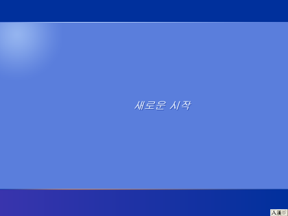

_레전드 오역_

학부 내용 복습하는 겸 프로젝트 진행 기록하려고 만들었습니다.  
학부 내용은 다음을 다룰 예정입니다.

- TC
> CSED233 데이터구조  
> CSED261 전산수학  
> CSED331 알고리즘  
> CSED341 오토마타및형식언어   

- SP
> CSED232 객체지향프로그래밍  
> CSED332 소프트웨어설계방법  

- NS
> CSED353 컴퓨터네트워크

- CS
> CSED273 디지털시스템설계  
> CSED211 컴퓨터 SW시스템 개론  
> CSED311 컴퓨터구조  
> CSED312 운영체제  

- DS
> CSED226 데이터분석 입문  

- ML
> CSED342 인공지능  
> CSED343 기계학습을 위한 수학  
> CSED515 기계학습  

마스터 플랜 짤때는 전공 많이 안 들은줄 알았는데, 3학년 마치고 보니까 차고 넘치네요.  
대학원 학점 이월 넣을거니까 더 들을겁니다.  

프로젝트는 다음을 기록할겁니다.
- 게임 개발 프로젝트
> FLAVITY    
> TO THE STAR    
> VR FPS (아직 이름 안 지었음)    
> 2024년 STadium 게임잼  
> 2025년 STadium 게임잼  

- AI 프로젝트
> 2023년 포카전 AI  
> 2024년 포카전 AI  
> 2025년 포카전 AI  
> 2025년 STadium AI  
> 과제연구I  

그냥 G-POS랑 POSCAT에 뼈를 묻어버렸습니다.  
학술동아리에 있으면 사람들이 프로그래밍하다가 정신이 나가버리는데, 그런 분위기가 마음에 들어요.  

_오늘은 학술동아리의 광기에 대해 얘기해주러 왔네._

그렇습니다. 다들 즐거운(~~아님~~) 공부하시길 바랍니다.